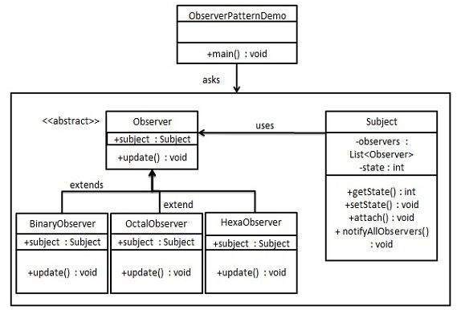
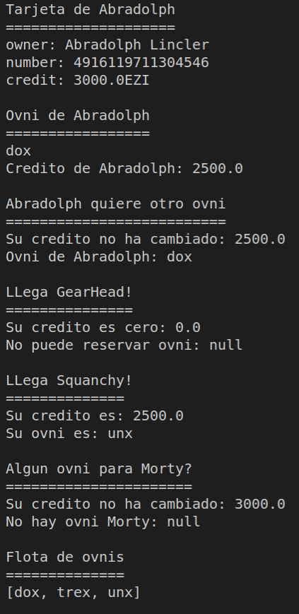
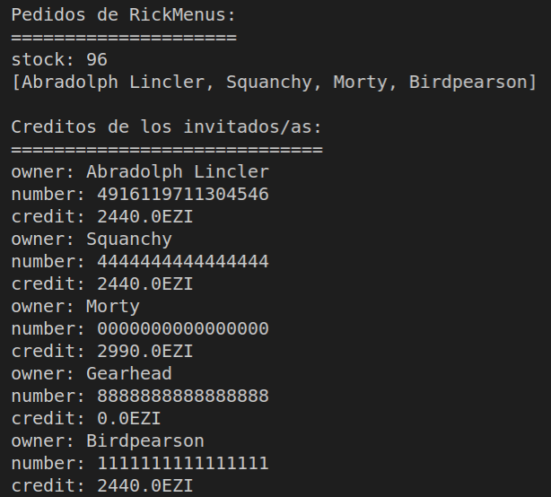

# Ricksy business exam

IMPORTANT! All the starting information was provided by my teacher before doing the exam. (UML, userstories, etc.)

Repository to the exam about riscky business that our teacher prepared to us. It is based in the observer pattern: [dfleta](https://github.com/dfleta/ricksy-business-observer)

This app consist in a "service" in which a user introduce its credit car and the system will get the money necesary to complete the service: getting a car, getting a pack, or a menu...

I completed it following the RicksyBusiness "app" and the UML. Tried to focus on adding Streams and Optional, to get familiar with it.

## Key concepts

* SOLID principles
* Polymorphism
* TDD
* Observer pattern

## Observer pattern

More information about it: [observer pattern](https://www.tutorialspoint.com/design_pattern/observer_pattern.htm)

## UML

## UserStory CLI

